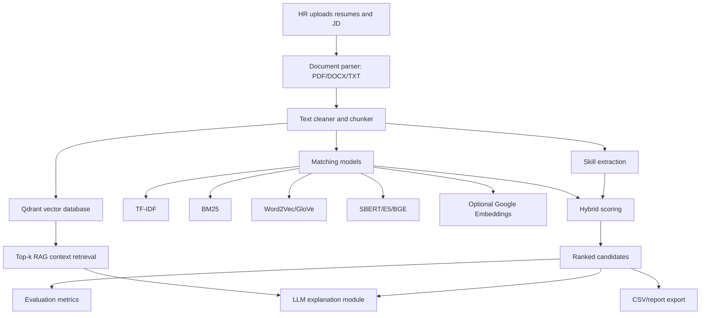

# AI-Powered Resume Screening Assistant for Job Description Matching

Bachelor-thesis-level project for ranking resumes against job descriptions using information retrieval baselines, semantic embedding models, Qdrant vector storage for RAG preparation, hybrid scoring, and LLM-based explanations.

The system supports HR screening. It does not make final hiring decisions.

## 1. Refined Project Proposal

**Refined thesis title:** Explainable AI-Powered Resume Screening Assistant for Resume-Job Description Matching.

**Problem statement:** HR teams often receive many resumes for one job description. Manual screening is slow and inconsistent, while fully automated screening can be opaque and risky. This project builds a transparent assistant that extracts CV/JD text, ranks candidates with reproducible NLP models, highlights matched and missing evidence, and uses an LLM only to explain already computed scores.

**Research questions:**

1. How do keyword-based baselines compare with semantic embedding models for resume-JD ranking?
2. Does a hybrid score combining semantic similarity, required skills, experience, and education evidence improve interpretability?
3. Which metrics are suitable when direct relevance labels are available or unavailable?
4. How can LLM explanations be constrained so they do not replace ranking models or introduce unsupported judgments?

**Objectives:**

1. Extract text from PDF, DOCX, and TXT resumes/JDs.
2. Clean and preprocess text while preserving technical entities.
3. Implement TF-IDF, BM25, Word2Vec, GloVe, SBERT, E5, BGE, optional Google Embeddings, and hybrid scoring.
4. Store cleaned JD/resume chunk embeddings in Qdrant to prepare a retrieval layer for RAG.
5. Rank candidates and explain matched/missing skills.
6. Evaluate with Precision@K, Recall@K, F1@K, NDCG@K, MRR, MAP, runtime, and optional classification metrics.
7. Provide a Streamlit demo, tests, scripts, and thesis documentation.

**Scope:** English-only CVs and JDs for the stable first version. Vietnamese-English support can be added with multilingual-e5 or BGE-M3.

**Limitations:** Public recruitment datasets are often synthetic, category-labeled, or weakly labeled. Automatically generated relevance labels are useful for controlled experiments but are not a substitute for HR expert annotation.

**Expected contributions:**

1. Modular implementation of resume-JD matching.
2. Fair comparison of classical IR and embedding methods.
3. Interpretable hybrid score with configurable weights.
4. Qdrant-based vector database layer for persistent chunk retrieval.
5. LLM explanation layer constrained to evidence from CV/JD text.
6. Reproducible evaluation pipeline for ranking metrics.

## 2. Dataset Recommendation

Use datasets in this order:

| Priority | Dataset | Kaggle slug | Why it is suitable | Use |
|---|---|---|---|---|
| 1 | [Resume Data for Ranking](https://www.kaggle.com/datasets/thejohnwick001/resume-data-for-ranking/data) | `thejohnwick001/resume-data-for-ranking` | Paired resume/JD data with a `matched_score` field, directly aligned with ranking evaluation. | Main train/validation/test ranking dataset. |
| 2 | [recruitment dataset](https://www.kaggle.com/datasets/surendra365/recruitement-dataset/versions/2) | `surendra365/recruitement-dataset` | Contains resumes, job descriptions, and a `Best Match` label/score. | Alternative labeled dataset. Drop protected attributes before modeling. |
| 3 | [AI-Powered Job Application Screening System](https://www.kaggle.com/datasets/suvroo/ai-powered-job-application-screening-system) | `suvroo/ai-powered-job-application-screening-system` | Structured recruitment workflow data with JDs and CV fields. | Demo and qualitative testing if labels are insufficient. |
| 4 | [Job Descriptions 2025 - Tech & Non-Tech Roles](https://www.kaggle.com/datasets/adityarajsrv/job-descriptions-2025-tech-and-non-tech-roles) | `adityarajsrv/job-descriptions-2025-tech-and-non-tech-roles` | 1,100 synthetic JDs across 55 roles with skills/responsibilities. | Weak pairing with resume-category datasets. |
| 5 | [Resume Dataset](https://www.kaggle.com/datasets/snehaanbhawal/resume-dataset) | `snehaanbhawal/resume-dataset` | 2,400+ resumes with text/PDF and job categories. | Resume extraction, classification, weak labels. |
| 6 | [job-skill-set](https://www.kaggle.com/datasets/batuhanmutlu/job-skill-set) | `batuhanmutlu/job-skill-set` | Job postings with extracted skill sets. | Skill dictionary expansion and JD analysis. |

### Ground Truth Strategy

**Preferred:** Use `matched_score` or `Best Match` as relevance labels. Normalize scores to `[0, 1]`; define relevant pairs as `relevance >= 0.65`.

**Weak-supervision fallback:** Pair resumes and JDs by matching resume category/job title and skill overlap. Positive pairs share the same role/category or high skill overlap. Negative pairs are sampled from different roles. These labels are weaker and must be described as automatically generated proxies.

### Dataset Splits

Split by `job_id`, not by individual rows, to prevent the same JD appearing in train and test:

- Train: 70% of job IDs for optional supervised baselines and threshold calibration.
- Validation: 15% of job IDs for choosing score weights and thresholds.
- Test: 15% of job IDs for final model comparison.
- Demo data: small TXT files in `data/sample_resumes/` and `data/sample_job_descriptions/`.

### Download Commands

Manual: open the Kaggle page, click Download, unzip files into `data/raw/`.

Kaggle API:

```bash
kaggle datasets download -d thejohnwick001/resume-data-for-ranking -p data/raw --unzip
kaggle datasets download -d surendra365/recruitement-dataset -p data/raw --unzip
kaggle datasets download -d adityarajsrv/job-descriptions-2025-tech-and-non-tech-roles -p data/raw --unzip
```

Project script:

```bash
python scripts/download_datasets.py --dataset ranking_pairs
python scripts/download_datasets.py --dataset all
```

## 3. Technical Architecture



Sentence embedding is calculated on cleaned document chunks for long resumes/JDs, then chunk scores are aggregated with mean of top-3 chunk similarities. TF-IDF, BM25, Word2Vec, and GloVe operate on the full cleaned document. Word2Vec and GloVe use mean-pooled pretrained token vectors. The Qdrant layer stores JD/resume chunk embeddings separately from the ranking pipeline so retrieved evidence can be supplied to a future RAG prompt.

Hybrid score:

```text
Final Match Score =
  0.50 x Semantic Similarity
+ 0.30 x Required Skill Match
+ 0.10 x Experience Match
+ 0.10 x Education/Certification Match
```

Weights are configurable in the Streamlit app. Scores are normalized to percentages from 0 to 100.

### Qdrant and RAG Preparation

Qdrant is used as an optional vector database, not as a replacement for the ranking model. The ranking model still computes candidate scores; Qdrant stores chunk vectors and retrieves the most relevant evidence chunks for RAG-style explanations or HR question answering.

Default behavior:

- If `QDRANT_URL` is not set, the app uses local embedded Qdrant storage at `outputs/qdrant_local`.
- If `QDRANT_URL` is set, the app connects to that Qdrant server and uses `QDRANT_API_KEY` when provided.
- The default collection is `resume_rag_chunks`.
- The default RAG embedding model is `RAG_EMBEDDING_MODEL`, falling back to E5 from `config/settings.py`.

Index sample documents:

```bash
python scripts/import_embeddings_to_qdrant.py
python scripts/check_qdrant_retrieval.py --top-k 5 --no-llm
```

Index your own files:

```bash
python scripts/index_qdrant.py --jd data/sample_job_descriptions/machine_learning_engineer.txt --resumes data/sample_resumes/candidate_alex_python_ml.txt data/sample_resumes/candidate_chris_data_analyst.txt
```

Streamlit also includes a **RAG Vector Store** page that indexes the currently loaded JD/resumes and retrieves top-k Qdrant chunks as a ready-to-use context block.

## 4. Model Comparison Plan

| Model | Type | Strength | Limitation |
|---|---|---|---|
| TF-IDF + Cosine | Baseline | Fast and interpretable | Weak semantic matching |
| BM25 | Baseline IR | Strong keyword ranking | Scores depend on candidate pool |
| Word2Vec | Static embedding baseline | Captures word-level semantic relatedness | Needs pretrained vectors; weak phrase/context handling |
| GloVe | Static embedding baseline | Lightweight semantic baseline | Needs pretrained vectors; averages away word order |
| SBERT | Semantic | Good local sentence embeddings | May lose long-document detail |
| E5 | Semantic retrieval | Designed for query-passage retrieval | Needs correct query/passage prefixes |
| BGE | Semantic retrieval | Strong general embedding baseline | Larger model download |
| Google Embeddings | API optional | Strong hosted model | Requires key, network, possible cost |

Fair comparison rules:

1. Use the same test split for all models.
2. Evaluate pure model score and hybrid score separately.
3. Report ranking metrics and average inference time per CV-JD pair.
4. Discuss effectiveness, runtime, cost, deployment difficulty, and explainability.

## 5. Complete Folder Structure

```text
ai_resume_screening/
├── app.py
├── README.md
├── requirements.txt
├── .env.example
├── config/
│   ├── settings.py
│   └── skill_dictionary.json
├── data/
│   ├── raw/
│   ├── processed/
│   ├── embeddings/
├── notebooks/
│   ├── Thesis_AI_resume.ipynb
├── scripts/
│   ├── create_sample_data.py
│   ├── download_datasets.py
|   ├── import_embeddings_to_qdrant.py
│   └── index_qdrant.py
├── src/
│   ├── data/
│   │   ├── dataset_loader.py
│   │   └── prepare_pairs.py
│   ├── preprocessing/
│   │   ├── document_parser.py
│   │   ├── text_cleaner.py
│   │   ├── skill_extractor.py
│   │   └── chunker.py
│   ├── models/
│   │   ├── tfidf_matcher.py
│   │   ├── bm25_matcher.py
│   │   ├── static_embedding_matcher.py
│   │   ├── word2vec_matcher.py
│   │   ├── glove_matcher.py
│   │   ├── sbert_matcher.py
│   │   ├── e5_matcher.py
│   │   ├── bge_matcher.py
│   │   ├── google_embedding_matcher.py
│   │   └── hybrid_matcher.py
│   ├── evaluation/
│   │   ├── ranking_metrics.py
│   │   ├── classification_metrics.py
│   │   ├── benchmark.py
│   │   └── visualization.py
│   ├── llm/
│   │   ├── explanation_chain.py
│   │   ├── chatbot_chain.py
│   │   └── structured_extraction.py
│   ├── services/
│   │   ├── matching_service.py
│   │   ├── ranking_service.py
│   │   └── export_service.py
│   └── utils/
│       ├── file_utils.py
│       └── constants.py
├── tests/
└── outputs/
```

## 6. Environment Setup

Windows:

```powershell
python -m venv .venv
.venv\Scripts\activate
pip install -r requirements.txt
```

If the Windows `python` alias is unavailable:

```powershell
py -3.10 -m venv .venv
.venv\Scripts\activate
python -m pip install -r requirements.txt
```

Linux/macOS:

```bash
python3 -m venv .venv
source .venv/bin/activate
pip install -r requirements.txt
```

Optional API keys:

```bash
cp .env.example .env
```

Set `GOOGLE_API_KEY` or `GEMINI_API_KEY` only if you want Gemini explanations, chatbot answers, or Google Embeddings.

## 7. Source Code Implementation

All source files are implemented under `src/`. Important entry points:

- `app.py`: Streamlit web application.
- `src/services/matching_service.py`: model selection, ranking, hybrid score integration.
- `src/models/`: baseline, semantic, optional API embedding, and hybrid models.
- `src/llm/structured_extraction.py`: JSON-only JD/CV extraction for required skills, preferred skills, tools, education, experience, projects, and JD requirement evidence.
- `src/llm/`: Gemini/LangChain explanations and deterministic fallback.
- `src/data/prepare_pairs.py`: relevance pair creation.
- `src/evaluation/benchmark.py`: model comparison pipeline.

The LLM is never used as the primary ranking model. If no API key is provided, explanation and chatbot modules return deterministic evidence-based summaries.

## 8. Streamlit Application

Run:

```bash
streamlit run app.py
```

Main pages:

- Home: purpose, responsible-use note, workflow.
- Screening: upload JD/resumes, extract structured JSON, select model, configure weights, rank candidates, explain details, chat, export.
- Evaluation: run ranking metrics on prepared test pairs.
- Dataset & Thesis: dataset setup notes.

The Screening page includes a **Structured JSON Extraction** panel. With `GOOGLE_API_KEY` or `GEMINI_API_KEY` configured, it uses Gemini to return JSON only:

- JD: `required_skills`, `preferred_skills`, `tools`, `education`, `experience`
- CV: `skills`, `education`, `experience`, `projects`

If no API key is configured, the app returns the same schema with deterministic dictionary/regex extraction so downstream calculation code can still run.

Hybrid scoring uses this structured JSON by default for skill match, experience match, and education/certification match. The selected matching model still provides the semantic similarity score; the text-based deterministic skill extractor is now only a fallback when structured scoring is disabled or no candidate extraction is available.

## 9. Evaluation Pipeline

Prepare primary paired dataset:

```bash
python -m src.data.prepare_pairs --primary-pairs data/raw/<ranking_dataset_file>.csv
```

Prepare weak labels if only separate resume and JD datasets are available:

```bash
python -m src.data.prepare_pairs ^
  --resume-file data/raw/<resume_dataset_file>.csv ^
  --job-file data/raw/<job_dataset_file>.csv
```

Linux/macOS:

```bash
python -m src.data.prepare_pairs \
  --resume-file data/raw/<resume_dataset_file>.csv \
  --job-file data/raw/<job_dataset_file>.csv
```

Run lexical baseline evaluation:

```bash
python -m src.evaluation.benchmark --pairs data/processed/test_pairs.csv --models tfidf,bm25
```

Run static embedding baselines:

```bash
python -m src.evaluation.benchmark --pairs data/processed/test_pairs.csv --models word2vec,glove --limit-jobs 20
```

Word2Vec and GloVe use `gensim` pretrained vectors. Defaults are `word2vec-google-news-300` and `glove-wiki-gigaword-100`; set `WORD2VEC_PATH` or `GLOVE_PATH` to use local vector files instead.

Run semantic models:

```bash
python -m src.evaluation.benchmark --pairs data/processed/test_pairs.csv --models sbert,e5,bge --limit-jobs 50
```

Outputs:

- `outputs/evaluation_results/scored_pairs_<model>.csv`
- `outputs/evaluation_results/group_metrics_<model>.csv`
- `outputs/evaluation_results/model_comparison.csv`

Metrics:

- Precision@K
- Recall@K
- F1@K
- NDCG@K
- MRR
- MAP
- Average inference time per pair

## 10. Running Instructions

Windows full flow:

```powershell
cd C:\Users\kimqu\project\thesis\ai_resume_screening
python -m venv .venv
.venv\Scripts\activate
pip install -r requirements.txt
python scripts\create_sample_data.py
pytest
streamlit run app.py
```

Windows fallback with Python launcher:

```powershell
cd C:\Users\kimqu\project\thesis\ai_resume_screening
py -3.10 -m venv .venv
.venv\Scripts\activate
python -m pip install -r requirements.txt
python scripts\create_sample_data.py
pytest
streamlit run app.py
```

Linux/macOS full flow:

```bash
cd ai_resume_screening
python3 -m venv .venv
source .venv/bin/activate
pip install -r requirements.txt
python scripts/create_sample_data.py
pytest
streamlit run app.py
```

Troubleshooting:

- `Python was not found` on Windows: use `py -3.10` or install Python 3.10+ and enable PATH.
- `No module named sentence_transformers`: install requirements in the active virtual environment.
- First SBERT/E5/BGE run is slow: models are downloaded from Hugging Face once and cached.
- Gemini explanation not generated: set `GOOGLE_API_KEY` or `GEMINI_API_KEY`; otherwise deterministic explanation is used.
- Kaggle download fails: verify `~/.kaggle/kaggle.json` or set `KAGGLE_USERNAME` and `KAGGLE_KEY`.
- PDF extraction is empty: the PDF may be scanned image-only; add OCR as a future extension.

## 11. Thesis Documentation Support

Suggested chapters:

1. Introduction: motivation, problem statement, objectives, scope.
2. Background and Literature Review: resume screening, IR ranking, TF-IDF, BM25, sentence embeddings, explainable AI, LLMs in HR support.
3. Methodology: architecture, preprocessing, models, hybrid scoring, LLM explanation constraints.
4. Implementation: Streamlit app, modules, dataset preparation, reproducibility.
5. Experiments and Results: datasets, splits, metrics, model comparison tables and charts.
6. Discussion: best model, runtime trade-offs, data limitations, bias/fairness risks.
7. Conclusion and Future Work.

Experimental setup template:

- Hardware/software environment.
- Dataset and split strategy.
- Model configurations.
- Metrics and relevance definition.
- Runtime measurement method.
- Reproducibility commands.

Result analysis template:

| Model | P@5 | R@5 | F1@5 | NDCG@5 | MRR | MAP | Runtime/pair | Notes |
|---|---:|---:|---:|---:|---:|---:|---:|---|
| TF-IDF |  |  |  |  |  |  |  | Fast baseline |
| BM25 |  |  |  |  |  |  |  | Strong lexical retrieval |
| SBERT |  |  |  |  |  |  |  | Semantic baseline |
| E5 |  |  |  |  |  |  |  | Retrieval embedding |
| BGE |  |  |  |  |  |  |  | Strong semantic model |

Ethical considerations:

- Do not use protected attributes such as age, gender, race, ethnicity, religion, disability, marital status, or family status.
- Treat the system as decision support, not an automated hiring decision maker.
- Keep explanations evidence-based and grounded in JD/CV text.
- Report dataset limitations, especially synthetic labels and weak supervision.
- Include human review for final decisions.
- Monitor disparate impact if deployed with real applicant data.

Future work:

- Expert human annotation of resume-JD relevance.
- OCR for scanned resumes.
- Section-aware resume parsing.
- Multilingual support with multilingual-e5 or BGE-M3.
- Fairness auditing and bias mitigation.
- Secure storage, access control, and privacy-preserving deployment.
